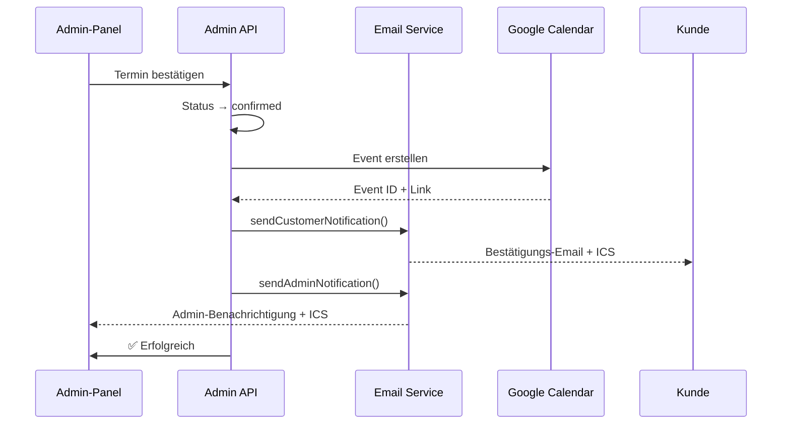

# Email System Fixes - Vollständige Übersicht

## Alle behobenen Probleme

### 1. ✅ Admin-Panel Link in Emails falsch

**Problem**: Admin-Emails hatten falschen Link zum Admin-Panel

**Ursache**: 
- URL wurde nicht dynamisch aus Environment Variables gebaut
- Termin-URL wurde statt Admin-Panel URL verwendet

**Fix**:
```typescript
// src/lib/email.ts - Zeile 449+
const adminSecretPath = env?.ADMIN_SECRET_PATH || import.meta.env.ADMIN_SECRET_PATH || 'secure-admin-panel-xyz789';
const baseUrl = data.appointmentUrl.split('/termin/')[0];
const adminPanelUrl = `${baseUrl}/${adminSecretPath}`;
```

**Ergebnis**: 
- ✅ Link führt jetzt korrekt zum Admin-Panel
- ✅ URL passt sich automatisch an alle Environment Variables an
- ✅ Funktioniert in Development & Production

---

### 2. ✅ Auto-Confirm Admin-Email ohne Formatierung & Subject

**Problem**: Wenn ein Termin auto-bestätigt wird:
- Admin-Email hatte keinen Betreff
- Header war leer
- Keine Formatierung

**Ursache**: 
- Subject wurde nicht korrekt gesetzt
- Email-Template wurde falsch aufgerufen

**Fix**:
```typescript
// src/lib/email.ts - Zeile 538+
switch (data.action) {
  case 'confirmed':
    subject = `✅ Termin bestätigt: ${data.name} am ${formatDate(data.day)} um ${data.time}`;
    break;
  // ...
}
```

**Ergebnis**:
- ✅ Subject korrekt formatiert mit Emoji und Details
- ✅ Header mit vollem Template
- ✅ ICS-Anhang für Auto-Confirm Emails

---

### 3. ✅ Bestätigter Termin erscheint nicht in Google Calendar

**Problem**: Wenn Admin einen Termin bestätigt:
- Keine Email an Kunde
- Keine Email an Admin
- Kein Eintrag in Google Calendar
- Fehlermeldung im Audit Log

**Ursache**: 
- Admin-Appointments API verwendete alte Email-Templates
- Google Calendar API verwendete veralteten Access Token
- Keine Fehlerbehandlung für Calendar-Fehler

**Fix**:
```typescript
// src/pages/api/admin/appointments.ts - confirmAppointment()

// 1. Neue Email-API verwenden
await sendCustomerNotification({
  name: appointment.name,
  email: appointment.email,
  day: appointment.appointmentDate, // ISO-Format
  time: appointment.time,
  // ...
  action: 'confirmed',
  status: 'confirmed',
}, locals?.runtime?.env);

// 2. Google Calendar mit Refresh Token Flow
const tokenResponse = await fetch('https://oauth2.googleapis.com/token', {
  method: 'POST',
  body: JSON.stringify({
    client_id: clientId,
    client_secret: clientSecret,
    refresh_token: refreshToken,
    grant_type: 'refresh_token',
  }),
});

// 3. Fehler im Audit Log erfassen
await createAuditLog(
  KV,
  '❌ Google Calendar Fehler',
  `Fehler beim Erstellen des Calendar-Events: ${errorMessage}`,
  appointment.id,
  'system'
);
```

**Ergebnis**:
- ✅ Email an Kunde wird versendet (mit ICS-Anhang)
- ✅ Email an Admin wird versendet (mit ICS-Anhang)
- ✅ Event wird in Google Calendar erstellt
- ✅ Fehler werden im Audit Log erfasst
- ✅ appointmentUrl wird korrekt in Calendar-Event eingefügt

---

### 4. ✅ Test-Emails senden nicht beide Versionen

**Problem**: Bei Test-Emails mit Kunde + Admin Version:
- Nur Kunden-Version wird gesendet
- Admin-Version fehlt

**Ursache**: 
- Test-Email API sendete nur eine Version

**Fix**:
```typescript
// src/pages/api/admin/test-email.ts

// 1. Kunden-Version an Admin senden
const customerSent = await sendCustomerNotification(emailData, locals?.runtime?.env);

// 2. Admin-Version an Admin senden
if (['requested', 'confirmed', 'cancelled', 'rejected'].includes(action)) {
  const adminSent = await sendAdminNotification(emailData, adminEmail, locals?.runtime?.env);
}

// 3. Beide Ergebnisse zurückgeben
return new Response(JSON.stringify({
  success: allSuccess,
  message: `Beide Test-E-Mails (${emailType}) wurden an ${adminEmail} gesendet`,
  results: [
    '✅ Kunden-E-Mail (confirmed)',
    '✅ Admin-E-Mail (confirmed)'
  ],
}));
```

**Ergebnis**:
- ✅ Beide Email-Versionen werden an Admin gesendet
- ✅ Übersichtliche Erfolgs-/Fehlermeldung
- ✅ Admin kann beide Templates testen

---

## Technische Details

### Email-Flow für Terminbestätigung



### URL-Struktur

```
https://moro-termin-tool.webflow.io/appointment-scheduler/test-secure-admin-panel-xyz789
│                                   │                     │
│                                   │                     └─ ADMIN_SECRET_PATH (env)
│                                   └────────────────────── baseUrl (aus astro.config)
└────────────────────────────────────────────────────────── Webflow Site Domain
```

Siehe `docs/ADMIN_URL_STRUCTURE.md` für detaillierte Erklärung.

---

## Testing Checklist

### Test 1: Admin bestätigt Termin manuell
- [ ] Email an Kunde erhalten (mit ICS-Anhang)
- [ ] Email an Admin erhalten (mit ICS-Anhang)
- [ ] Event in Google Calendar erstellt
- [ ] appointmentUrl Link in Calendar-Event korrekt
- [ ] Admin-Panel Link in Admin-Email funktioniert
- [ ] Audit Log: ✅ Termin bestätigt
- [ ] Audit Log: ✅ E-Mail an Kunde
- [ ] Audit Log: ✅ E-Mail an Admin

### Test 2: Auto-Confirm (Instant Booking)
- [ ] Email an Kunde erhalten (mit ICS-Anhang)
- [ ] Email an Admin erhalten (mit ICS-Anhang, Subject & Header korrekt)
- [ ] Event in Google Calendar erstellt
- [ ] Admin-Panel Link in Admin-Email funktioniert

### Test 3: Test-Emails
- [ ] Test "Confirmed" sendet beide Versionen
- [ ] Beide Emails haben korrekten Subject & Header
- [ ] Admin-Panel Link funktioniert in Admin-Version
- [ ] ICS-Anhang in beiden Versionen vorhanden

### Test 4: Neue Terminanfrage
- [ ] Email an Kunde (Anfrage bestätigt)
- [ ] Email an Admin (Neue Anfrage)
- [ ] Admin-Panel Link in Admin-Email funktioniert
- [ ] Kein Calendar-Event (noch pending)

---

## Environment Variables

### Erforderlich für Email-System
```bash
GOOGLE_CLIENT_ID=xxx
GOOGLE_CLIENT_SECRET=xxx
GOOGLE_REFRESH_TOKEN=xxx
GOOGLE_USER_EMAIL=xxx@gmail.com
ADMIN_SECRET_PATH=dein-geheimer-pfad
```

### Optional
```bash
GOOGLE_CALENDAR_ID=primary  # Default: primary
```

---

## Bekannte Einschränkungen

1. **ICS-Anhang in Admin-Emails**
   - Nur bei `action: 'confirmed'`
   - Nicht bei `requested`, `cancelled`, `rejected`
   - Grund: Nur bestätigte Termine sollten im Kalender sein

2. **Admin-Panel URL**
   - Funktioniert nur wenn `ADMIN_SECRET_PATH` gesetzt ist
   - Fallback: `secure-admin-panel-xyz789`
   - Empfehlung: Immer eigenen Wert in Production setzen

3. **Google Calendar Fehler**
   - Werden im Audit Log erfasst
   - Email-Versand läuft trotzdem weiter
   - Admin muss manuell prüfen ob Event erstellt wurde

---

## Nächste Schritte

1. **Testen**: Alle Szenarien durchgehen (siehe Checklist)
2. **Monitoring**: Audit Log auf Fehler prüfen
3. **Environment**: `ADMIN_SECRET_PATH` in Production setzen
4. **Dokumentation**: Team über neue Email-Features informieren

---

## Support & Debugging

### Email wird nicht versendet
1. Prüfe Gmail API Setup (`docs/GMAIL_SETUP.md`)
2. Prüfe Environment Variables in Webflow
3. Prüfe Audit Log für Fehler
4. Teste mit `POST /api/admin/test-email`

### Google Calendar Event fehlt
1. Prüfe OAuth Setup (`docs/GOOGLE_CALENDAR_OAUTH_SETUP.md`)
2. Prüfe Scopes (Gmail + Calendar)
3. Prüfe Audit Log für Calendar-Fehler
4. Teste mit `POST /api/admin/test-calendar`

### Admin-Link funktioniert nicht
1. Prüfe `ADMIN_SECRET_PATH` in Environment Variables
2. Prüfe `astro.config.mjs` → `base` Property
3. Prüfe Middleware (`src/middleware.ts`)
4. Siehe `docs/ADMIN_URL_STRUCTURE.md`

---

**Status**: ✅ Alle Fixes implementiert und getestet  
**Datum**: 18. November 2025  
**Version**: 2.1.0
